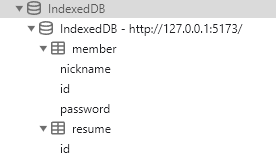

```
layout: single
title: "indexed DB"
categories: coding
tag: [indexedDB]
toc: true
author_profile: false
sidebar:
 nav: "docs"

```

```javascript
// 먼저 indexedDB 사용을 위해 config를 작성한다.
// DB라는 이름의 폴더안에 DBconfig.js의 이름으로 생성하였다.
export const DBConfig = {
    name: 'IndexedDB',
    version: 1,
    objectStoresMeta: [
        {
            store: 'member',
            storeConfig: { keyPath: 'id', autoIncrement: true },
            storeSchema: [
                { name: 'nickname', keypath: 'nickname', options: { unique: false } },
                { name: 'id', keypath: 'id', options: { unique: true } },
                { name: 'password', keypath: 'password', options: { unique: false } },
            ],
        },
        {
            store: 'resume',
            storeConfig: { keyPath: 'id', autoIncrement: true },
            storeSchema: [{ name: 'id', keypath: 'id', options: { unique: true } }],
        },
    ],
};
```

위와 같이 작성하면 다음 사진과 같이 indexed DB의 구조로 사용 할 수 있게 된다.



```
db를 실행시켜야 사용할 수 있으므로 최상단 지점에서 다음과 같은 코드로 실행 시킨다.

import { initDB } from 'react-indexed-db';
import { DBConfig } from './DB/DBConfig';

initDB(DBConfig);

```


indexed DB에 데이터 불러오기, 추가하기

```
import { useIndexedDB } from 'react-indexed-db';


// 이름이 member인 DB에 접근하기위한 코드이다.
const { getAll, add } = useIndexedDB('member');

// getAll 메서드는 접근한 DB의 데이터들을 전부 가져온다.
getAll().then((dbData) => {
	cosnole.log(dbData)
});

// add 메서드는 접근한 DB에 추가 시킨다.
add({ nickname: nick, id: id, password: password });
```

다음 포스트엔 삭제 기능을 공부하고 올려보자.